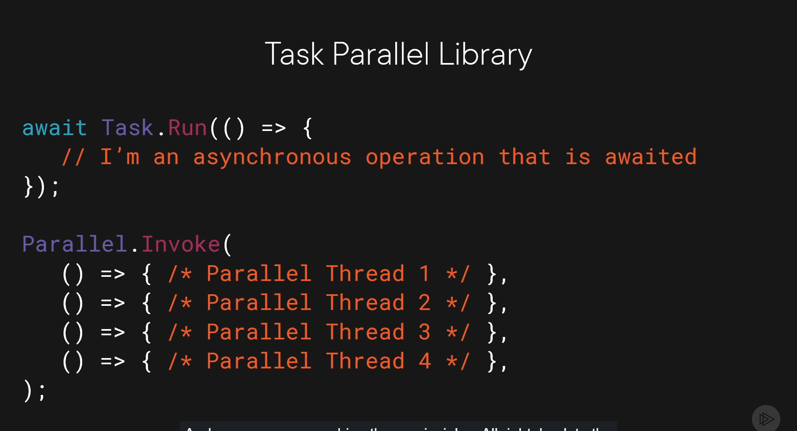
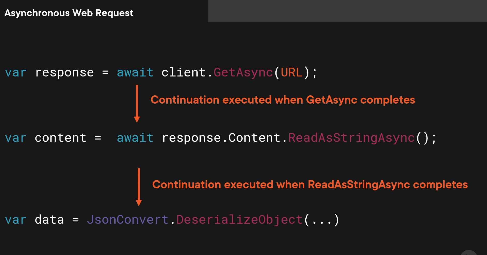
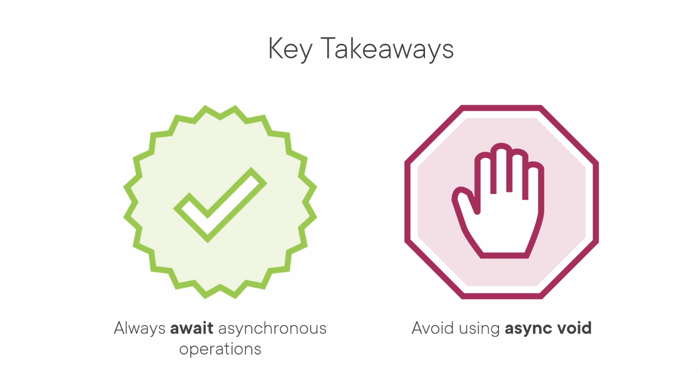
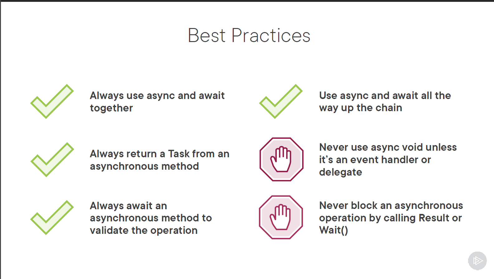
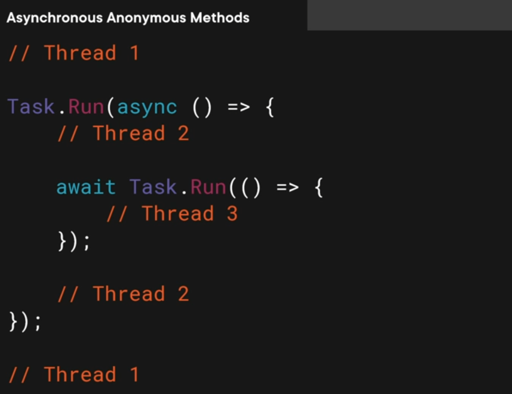
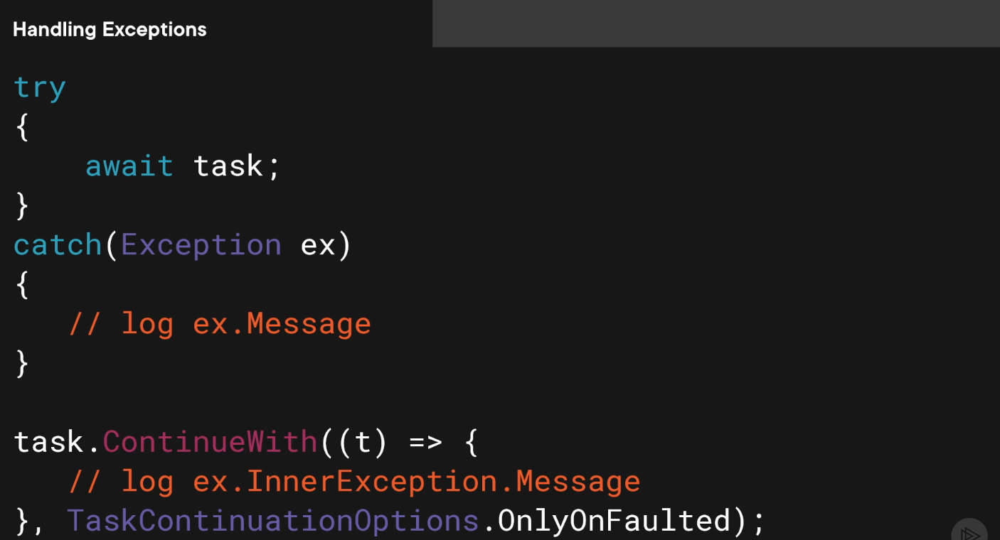

Asynchronous Programming in C#
==============================
- `async programming` is applicable for any type of .net app including wpf, WinUI3, .net maui, asp.net etc
- `An asynchronous operation occurs in parallel` and relives the calling thread of the work.
- ways to achieve asynchronous programming in C#:
  - `async` and `await` keywords - widely used
  - Threading low level 
  - Task Parallel Library (TPL) - widely used
  - BackgroundWorker - event based asynchronous pattern
### async and await keywords 
  - are used to create asynchronous methods in C#.
  - suited for Disk, Network, Database, I/O bound operations for cpu bound operations use Task Parallel Library (TPL).
  - you cannot make the method async by just adding async keyword, you need to use await keyword inside the method
  - marking a method as async introduces the capability of using the await keyword to leverage the asynchronous principles.
  - `async` keyword is used to define an asynchronous method
  - calling `Result` or `Wait()` may cause deadlocks
  - Use `await` with a Task to retrieve the result and to validate it completed successfully.
  - `await` keyword is used to pause the execution of the method until the awaited task completes.
  - await keyword gives you a potential result
  - validates the success of the operation
  - continuation is back on calling thread. a continuation allowing you to get back to the original context.
  - The await keyword will re-throw exceptions that occurs inside the Task.
  - Using async and await in ASP.NET means the web server can handler other requests, without blocking other requests.
  - Only use `async void` for event-handlers. `async void` is evil and avoid it all cost.
  - Exception occuring in an async void method cannot be caught. app might crash

```csharp
// This is a blocking call, blocks the thread until result is available.
var content = await response.Result.Content.ReadAsStringAsync();
```










### Task Parallel Library
- TPL is used for cpu bound operations and independent chunks of data. 
- Task from the TPL represent a single async operation.
- Task
  - Execute work on a different thread
  - Get the result from the async operation
  - Subscribe to when the operation is done by introducing a continuation
  - it can tell you if there was an exception
  - it can tell you if the operation was cancelled
  - Generic and NonGeneric Task.Run
  - Updating UI elements can only be done from the UI Thread.
  - background thread cannot update UI elements directly.
  - A task can have multiple continuations
  - `async and await` is much more readable and maintainable than `Task.Run` and `ContinueWith`
  - The continuation executes asynchronously on a different thread.
- Loading the data in parallel by performing multiple async operations at the same time.
- Don’t use List<T> for parallel operations it is not thread-safe.
- Use ConcurrentBag<T> for parallel operations.
- 
```csharp
Task.Run(() => { /* Heavy operation */ });
Task.Run(SomeMethod);

// continuation with task
        try
        {
            // we are avoiding block of ui thread to load file once the file is loaded we will update the ui
            //Stocks.ItemsSource = await GetStocksFromFile();
            var loadLinesTask = Task.Run(() =>
            {
                var lines = File.ReadAllLines("StockPrices_Small.csv");
                return lines;
            });

            var faultedTask = loadLinesTask.ContinueWith(
                (task) => { Dispatcher.Invoke(() => { Notes.Text = task?.Exception?.InnerException?.Message; }); },
                TaskContinuationOptions.OnlyOnFaulted);

            var processedTask = loadLinesTask.ContinueWith((completedtask) =>
            {
                var data = new List<StockPrice>();
                foreach (var line in completedtask.Result.Skip(1))
                {
                    var price = StockPrice.FromCSV(line);
                    data.Add(price);
                }

                return data;
            }, TaskContinuationOptions.OnlyOnRanToCompletion);

            var _= processedTask.ContinueWith(p =>
            {
                // add below code inside a disptcher
                Dispatcher.Invoke(() =>
                {
                    // previous task is not cancelled
                    if (p.IsCanceled == false)
                        Stocks.ItemsSource = p.Result;
                    AfterLoadingStockData();
                });
            });
        }
        catch (Exception exception)
        {
            Console.WriteLine(exception);
            Notes.Text = exception.Message;
        }
```

Cancellation
```csharp
if (_cancellationTokenSource is not null)
        {
            _cancellationTokenSource.Cancel();
            _cancellationTokenSource.Dispose();
            _cancellationTokenSource = null;

            Search.Content = "Search";
            return;
        }

        try
        {
            _cancellationTokenSource = new CancellationTokenSource();
            _cancellationTokenSource.Token.Register(() => { Notes.Text = "Request Cancelled"; });
            Search.Content = "Cancel";

            // we are avoiding block of ui thread to load file once the file is loaded we will update the ui
            var items = await GetStocksFromFile(_cancellationTokenSource.Token);

            Stocks.ItemsSource = items;
            AfterLoadingStockData(items != null ? items.Count() : 0);

            _cancellationTokenSource.Dispose();
            _cancellationTokenSource = null;
            Search.Content = "Search";
        }
        catch (Exception exception)
        {
            Console.WriteLine(exception);
            Notes.Text = exception.Message;
        }
```

loads items in a sequnce of the result
```csharp
foreach (var identifier in identifiers)
            {
                var loadTask = stockService.GetStockPricesFor(identifier, _cancellationTokenSource.Token);

                loadTask = loadTask.ContinueWith((completedTask) =>
                {
                    var aFewStocks = completedTask.Result.Take(5);
                    foreach (var stock in aFewStocks)
                    {
                        allStocks.Add(stock);
                    }   
                    
                    // updating UI on the main thread
                    Dispatcher.Invoke(() => { Stocks.ItemsSource = allStocks.ToArray(); });
                    
                    return aFewStocks;
                });

                
                loadTasks.Add(loadTask);
            }

            await Task.WhenAll(loadTasks);
```