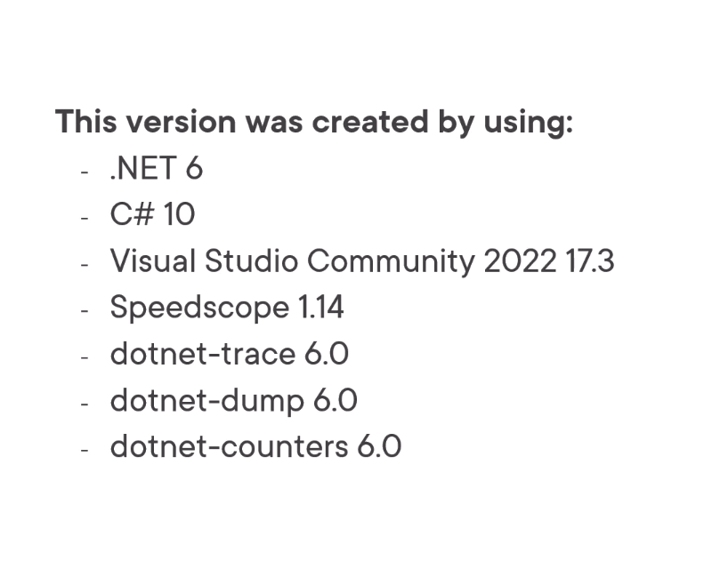
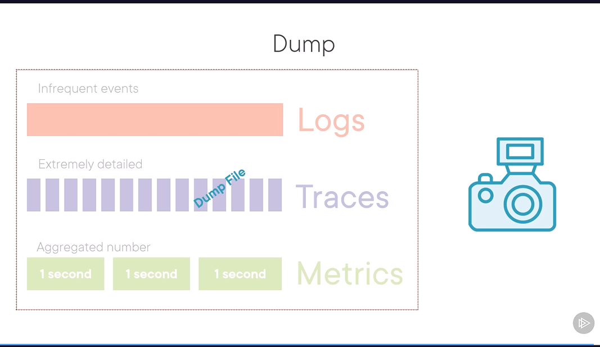
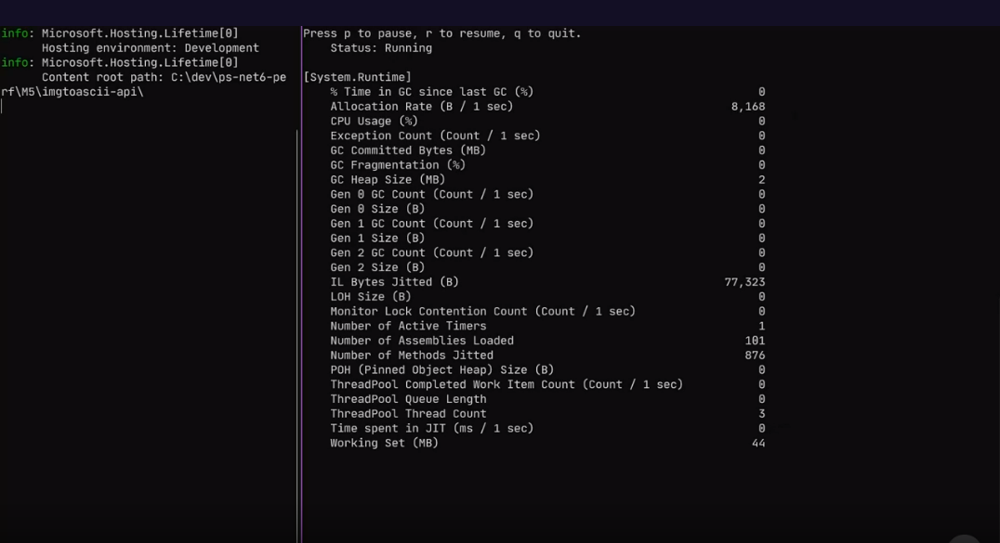
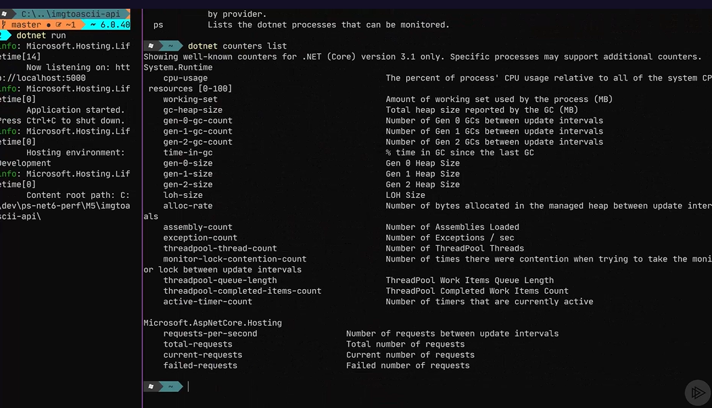
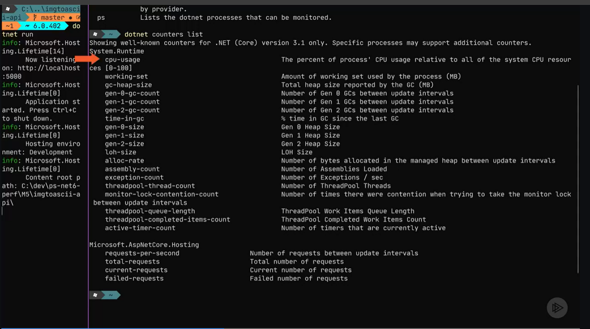

# Performance Measuring and Monitoring for .NET 6 Applications

### Why Monitoring
- Monitoring; Analysing, evaluating, interpreting data results
- Measuring: Discovery of the exact size of the amount of something
- Performance: Responsiveness and stability under a particular workload

`Performance improvement is cool, important to the success of your business and applications`

- Monthly cloud costs
- Prevent accidents and failures
- Corporate image and customer service
- Customer Churn - when developing desktop and mobile app
- Great user experience
- Track deployments and improvements

.NET Benefits
 - Virtual Machine
 - C#
 - Libraries with BCL
 - Framework Tools
 - Performance improvements - global leader
 - Monitoring and measuring tools
 - .NET 6 - Monitoring subsystem - part of the runtime, works on any platform where .net runs
 - Event Tracing for Windows (ETW) - Windows only - before .NET Core
 - .NET 6 Monitoring subsystem
 - Non Intrusive - no need to change the code and add more logging


### Performance Measuring and Monitoring
 - `Performance Optimization must be drive by business needs.`
 - constant measuring and monitoring
 - do it in a free time as a hobby.
 - optimize a wrong part
   - server takes a long time to start
   - But afterwards is fast
   - not worth the effort
   - does not make any difference
   - time could be spent on thing that do.
### What to Monitor
 - Metrics are key part of the system
 - Numeric values count, sum 
 - system CPU usage, process CPU
 - Basic Metrics
   - CPU
   - Memory
   - Disk
   - Internet Traffic
 -  Garbage Collector heap size
 - LOH Size
 - Assembly Count
 - Time spent during GC
 - Number of timers
 - Requests
   - Per Second
   - Executing now
   - Failed
   - Average Duration and Size
 - Tracing: Collecting very detailed metrics very fast

### What is available
- Logs
- Traces
  - understand program flow to understand performance of the program
  - logging is only 1-2
  - built in tools
  - trace used by .net team itself
- Metrics
  - built on top of tracing data
  - aggregated view
  - tools built in
- Distributed Tracing
  - record application request
  - different application components
  - even different microservices
  - amount of data each component takes
  - dependencies between components
- Dumps
  - very low level
  - snapshot in time
  - save to file and analyze
  - tools built in
    - terminal and visual studio
    
  

### Tracing and Logging
- Logs: Infrequent Events
  - almost every app
  - relatively small amount of events
  - Always on
  - Manual
  - Predictable performance overhead
  - Pushed to central server
  - stored long term
  - unstructured or structured

Tracing: Extremely detailed
 - narrow usecase
 - very rich, thousand per seconds
 - concision decision to turn on
 - pre-instrumented
 - zero when off, high when on, disk usage
 - collected on demand
 - discarded after solving an issue

Tracing in .NET Framework
 - platform specific
 - Event Tracing for windows
   - windows only
   - high performance structured logging
 - System.Diagnostic.Trace/Debug
   -  rich but older
 - System.Diagnostic.EventLog
 - ILogger
 - System.Diagnostic.NETCore.Client - diagnostic client
 - .nettrace format
 - every dotnet process has a diagnostic port open by default
 - it can trace event by request
 - Microsoft-Windows-DotNetRuntime

```cs
 dotnet tool install -g dotnet-trace
     dotnet tool list -g
    dotnet trace collect 
     
```
### Metrics
- PerformanceCounter
- EventCounters
- System.Diagnostic.Metrics (#fully compitable with open telemetry)
  - more functional
  - More metric types
  - ThreadSafe
  - relatively new

```csharp
- dotnet tool install -g dotnet-counters
- dotnet counter cli

dotnet counters monitor -p 102761(processid)
dotnet counters monitor -p 102761 --counters System.Runtime,Custom.Monitor,    
```



