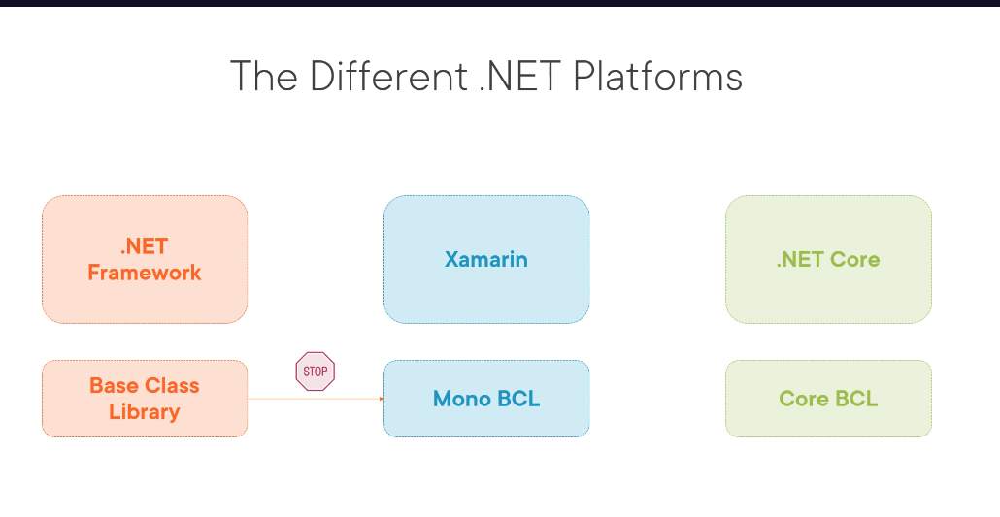

## What is New in .NET 6 and C# 10
- Unification of .net platforms,
- single BCL and single SDK
- there is no core word with .NET 6
- 64 bit of visual studio 2022 support
- Hot Reload support while debugging for xaml and C#
- C# 10 = new version
- new templates addition for visual studio 
- ASP.NET Core 6
- Angular template support bootstrap 5
- most ASP.NET Core 6 changes are for Blazor
- Start of Minimal API Support
- .NET MAUI support - next evolution of Xamarin.Forms
- EF Core 6, C++
- Released in Nov 2021
- Promoting MAUI and Blazor for web and other clients
- started with .NET 5 in 2020 completed in 2021 with .NET 6
- .NET 6 is a LTS supported until Nov 2024
- update asap
- current release: supported only 6 moths after release of next version.
- LTS - long term support: supported for 3 years after release of next version.
- good strategy to just move from a LTS to LTS, e.g .NET 6 to .NET 8
### Unification of .NET 
-  legacy: .NET Framework 4.8, Xamarin (mono, ios/Android), .NET Core (cross platform)
- .NET Standard helped to shared the code
- Mono: Original open source of .NET built from .NET framework 2.0
- a single platform after unification **.NET 6**
- single .NET for building all types of apps, desktop, cloud, mobile, IOT etc
- Single SDK and BCL
- Program.cs and Startup.cs is combined into a single class Program.cs
- ConfigureService and ConfigureMethod is not available.
- support for Bootstrap 5.1

### What is new in Visual Studio 2022
- support for Hot Reload
  - Avoid App Restarts
  - Support for C# Code and XAML
  - support for CLI tools
  - can be enabled on save
  - works in debug configuration
  - some code changes are not supported
  - if it not works just restart
  - support for project types ASP.NET Core, Blazor, Console, WinForms, WPF, UWP, WinUI3, .NET MAUI, Azure Functions
  - C# and VB are supported.
- New Project templates
- new icons and tab color
- 64 bit version support

### ASP.NET Core Platform
 - ASP.NET Core MVC => ASP.NET MVC in legacy .net framework
   - Server side application
   - Generated html is generated at server and sent to client
   - ASP.NET Core 6 MVC is fully compatible with previous version
 - ASP.NET Core Razor Pages
 - ASP.NET Core Blazor(client side, server side)
 - ASP.NET Core APIs

### New Features in .NET 6 and C# 10.
- C# 10 new feature
  - global `using statement`
  - file-scoped namespaces
  - extended property types
  - structure type changes
  - const interpolated strings.
  - changes to record
  - assignment and declaration in same deconstruction.

global using
```csharp
global using System;
global using System.Collections.Generic;
global using System.Linq
```
file scoped namespace
```csharp
namespace SampleNamespace;
public class Example
{
}
```
const string interpolation
```csharp
const string folderPath="/docs";
const string logFilePath = $"{folderPath}/log.txt";
```
implicit using common namespaces
```csharp
  <ImplicitUsings>enable</ImplicitUsings>
 
// included namespaces by default 
// 01_CSharpFundamentals\BethanysPieShopHRM\obj\Debug\net8.0
global using global::System;
global using global::System.Collections.Generic;
global using global::System.IO;
global using global::System.Linq;
global using global::System.Net.Http;
global using global::System.Threading;
global using global::System.Threading.Tasks;
```
DateOnly and TimeOnly
```csharp
  public DateOnly date = new DateOnly(10,2,3);
  public TimeOnly time = new TimeOnly(12, 12, 12);

    public void PrintData()
    {
        Console.WriteLine(date.ToLongDateString());
        Console.WriteLine(time.ToLongTimeString());
        
        
        Console.WriteLine(Environment.ProcessId);
        Console.WriteLine(Environment.ProcessPath);
    }
```





## What is new in .NET 7 and C# 11


## What is new in .NET 8 and C# 12